# D&D Character Creator - Architecture Documentation

## Overview

The D&D Character Creator is a full-stack web application built with React and AWS Amplify that provides a guided, multi-step character creation experience for D&D 5e. The application features secure user authentication, real-time data persistence, and a responsive dashboard for character management.

## Tech Stack

**Frontend**: React 18, TypeScript, Vite, Tailwind CSS, React Router
**Backend**: AWS Amplify, AWS AppSync (GraphQL), Amazon DynamoDB, Amazon Cognito
**Hosting**: AWS Amplify Console

## Architecture Diagram

```mermaid
graph TB
    %% User Layer
    User[👤 User]
    
    %% Frontend Layer
    subgraph "Frontend (React + Vite + TypeScript)"
        Router[🌐 React Router]
        
        subgraph "Pages"
            Dashboard[📊 DashboardPage]
            CreateChar[🧙 CreateCharacterPage]
        end
        
        subgraph "Components"
            Layout[🏗️ DashboardLayout]
            Stepper[📋 Character Creation Stepper]
            
            subgraph "Creation Steps"
                Basics[1️⃣ BasicsStep]
                Race[2️⃣ RaceStep]
                Class[3️⃣ ClassStep]
                Abilities[4️⃣ AbilitiesStep]
                Background[5️⃣ BackgroundStep]
                Review[6️⃣ ReviewStep]
            end
            
            subgraph "Dashboard Sections"
                CharSection[👥 CharactersSection]
                StatsSection[📈 StatsSection]
                CampaignSection[🗡️ CampaignsSection]
                ActivitySection[📝 RecentActivitySection]
            end
        end
        
        subgraph "Utils & Data"
            CreateUtil[💾 createCharacter.ts]
            FetchUtil[📥 fetchCharacters.ts]
            UpdateUtil[✏️ updateCharacter.ts]
            Types[📝 character.ts types]
        end
    end
    
    %% AWS Amplify Layer
    subgraph "AWS Amplify Backend"
        subgraph "Authentication"
            Cognito[🔐 Amazon Cognito]
            UserPool[👥 User Pool]
        end
        
        subgraph "API Layer"
            AppSync[🔄 AWS AppSync<br/>GraphQL API]
            Client[📡 Generated Client]
        end
        
        subgraph "Data Layer"
            DynamoDB[🗄️ DynamoDB]
            CharacterTable[📋 Character Table]
        end
        
        subgraph "Hosting"
            AmplifyHost[☁️ Amplify Hosting]
        end
    end
    
    %% Data Model
    subgraph "Character Data Model"
        CharModel["📄 Character Schema<br/>• name, race, class<br/>• background, alignment<br/>• level, experience<br/>• abilities JSON<br/>• proficiencies JSON<br/>• traits JSON"]
    end
    
    %% Connections
    User --> Router
    Router --> Dashboard
    Router --> CreateChar
    
    Dashboard --> Layout
    CreateChar --> Layout
    Layout --> CharSection
    Layout --> StatsSection
    Layout --> CampaignSection
    Layout --> ActivitySection
    
    CreateChar --> Stepper
    Stepper --> Basics
    Stepper --> Race
    Stepper --> Class
    Stepper --> Abilities
    Stepper --> Background
    Stepper --> Review
    
    Review --> CreateUtil
    Dashboard --> FetchUtil
    CharSection --> FetchUtil
    CharSection --> UpdateUtil
    
    CreateUtil --> Client
    FetchUtil --> Client
    UpdateUtil --> Client
    
    Client --> AppSync
    AppSync --> DynamoDB
    DynamoDB --> CharacterTable
    CharacterTable --> CharModel
    
    User -.->|Authentication| Cognito
    Cognito --> UserPool
    UserPool -.->|JWT Tokens| AppSync
    
    Router -.->|Protected Routes| Cognito
    AmplifyHost -.->|Hosts| Router
    
    %% Styling
    classDef frontend fill:#e1f5fe
    classDef aws fill:#fff3e0
    classDef auth fill:#f3e5f5
    classDef data fill:#e8f5e8
    
    class Router,Dashboard,CreateChar,Layout,Stepper,Basics,Race,Class,Abilities,Background,Review,CharSection,StatsSection,CampaignSection,ActivitySection,CreateUtil,FetchUtil,UpdateUtil,Types frontend
    class AppSync,Client,AmplifyHost aws
    class Cognito,UserPool auth
    class DynamoDB,CharacterTable,CharModel data
```

## Core Components

### Frontend Layer (React/Vite)

#### **Main Application** (`src/App.tsx`)
- Router setup with authentication integration
- Route protection and navigation management

#### **Pages**
- **Dashboard** (`src/features/pages/DashboardPage.tsx`) - Character management hub with sections for characters, campaigns, stats, and recent activity
- **Character Creator** (`src/features/pages/CreateCharacterPage.tsx`) - Multi-step wizard interface

#### **Character Creation Components** (`src/features/components/CharacterCreation/`)
- **Stepper Navigation** - Progress tracking through creation steps
- **6-Step Wizard Process**:
  1. **Basics** - Name, alignment, HP, AC, initiative
  2. **Race** - Race selection with ability bonuses and traits
  3. **Class** - Class selection with subclass options
  4. **Abilities** - Ability score generation (random/standard array/manual)
  5. **Background** - Background traits, personality, ideals, bonds, flaws
  6. **Review** - Final character review and save

#### **Utility Functions** (`src/features/utils/`)
- `createCharacter.ts` - Character creation and saving logic
- `fetchCharacters.ts` - Character retrieval with owner filtering
- `updateCharacter.ts` - Character modification operations

### Backend Layer (AWS Amplify)

#### **Authentication** (`amplify/auth/resource.ts`)
- Amazon Cognito user authentication
- User pool management
- JWT token-based authorization

#### **Data API** (`amplify/data/resource.ts`)
- GraphQL API via AWS AppSync
- Owner-based authorization rules
- Generated TypeScript client

#### **Database Schema**
- **Character Model** in DynamoDB with fields:
  - Basic info: name, race, class, background, alignment
  - Game mechanics: level, experience points, HP, AC, initiative
  - Complex data stored as JSON: abilities, proficiencies, traits, bonuses

#### **Generated Client** (`amplify/data/client.ts`)
- Type-safe GraphQL operations
- Automatic query/mutation generation

## Data Flow

### Authentication Flow
1. User signs up/logs in through Cognito
2. JWT tokens issued for API authorization
3. Owner-based access control applied to all operations

### Character Creation Flow
1. User navigates through 6-step wizard
2. Form data accumulated in React state
3. Final submission triggers `saveCharacter()`
4. GraphQL mutation sent to AppSync
5. Data persisted to DynamoDB with owner association

### Character Retrieval Flow
1. Dashboard loads and calls `fetchCharacters()`
2. GraphQL query filters by current user's owner ID
3. Character data returned and displayed in dashboard sections

## Key Features

### 🎯 **Multi-Step Character Creation**
- Guided wizard interface with progress tracking
- Data validation at each step
- Ability to navigate back and forth between steps

### 🔐 **Secure User Management**
- AWS Cognito integration for authentication
- Owner-based authorization ensuring users only see their characters
- Protected routes and API endpoints

### 💾 **Flexible Data Storage**
- JSON fields for complex D&D data structures
- Efficient storage of abilities, proficiencies, and character traits
- Type-safe interfaces for frontend/backend communication

### 📱 **Responsive Dashboard**
- Character management and overview
- Statistics and activity tracking
- Modular component architecture

## Development Considerations

### **Security**
- All API operations require authentication
- Owner-based access control prevents unauthorized data access
- No sensitive data exposed in client-side code

### **Scalability**
- Serverless architecture with AWS Lambda auto-scaling
- DynamoDB provides high-performance NoSQL storage
- GraphQL API enables efficient data fetching

### **Type Safety**
- Full TypeScript implementation
- Generated types from GraphQL schema
- Compile-time validation of data structures

### **Performance**
- Vite for fast development and optimized builds
- Component-based architecture for efficient re-rendering
- JSON storage minimizes database queries

## Future Enhancements

- Campaign and session management
- Character sheet PDF export
- Real-time collaboration features
- Custom avatar uploads
- Automated level-up mechanics
- Comprehensive testing suite