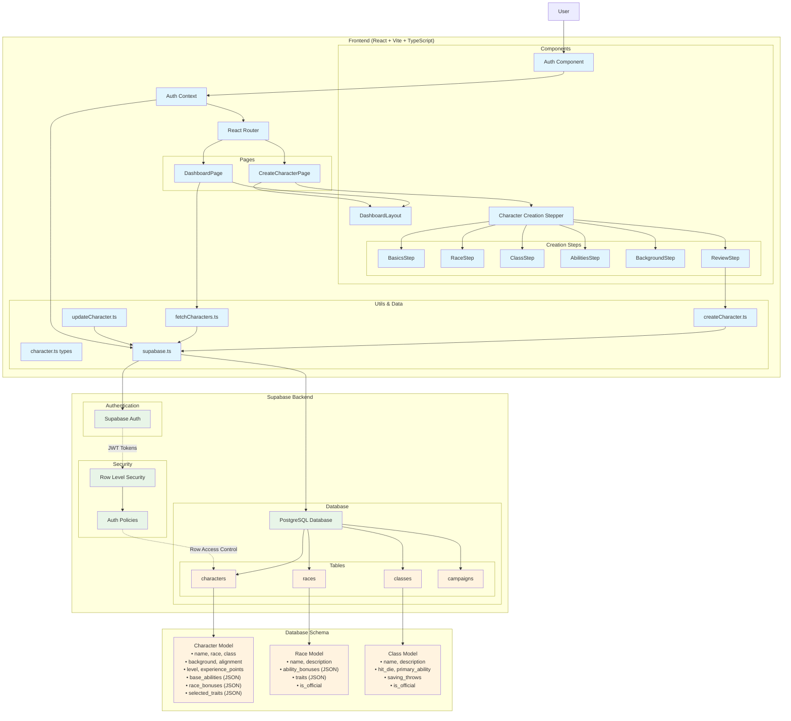

# D&D Character Creator - Architecture Documentation

## Overview

The D&D Character Creator is a full-stack web application built with React and Supabase that provides a guided, multi-step character creation experience for D&D 5e. The application features secure user authentication, real-time data persistence, and a responsive dashboard for character management.

## Tech Stack

**Frontend**: React 18, TypeScript, Vite, Tailwind CSS, React Router, Redux Toolkit
**Backend**: Supabase (PostgreSQL + Auth + Real-time)
**Hosting**: Deployment-flexible (Vercel, Netlify, etc.)

## Architecture Diagram

## Core Components

### Frontend Layer (React/Vite)

#### **Main Application** (`src/App.tsx`)
- Router setup with authentication integration
- Route protection and navigation management

#### **Pages**
- **Dashboard** (`src/features/pages/DashboardPage.tsx`) - Character management hub with sections for characters, campaigns, stats, and recent activity
- **Character Creator** (`src/features/pages/CreateCharacterPage.tsx`) - Multi-step wizard interface

#### **Character Creation Components** (`src/features/components/CharacterCreation/`)
- **Stepper Navigation** - Progress tracking through creation steps
- **6-Step Wizard Process**:
  1. **Basics** - Name, alignment, HP, AC, initiative
  2. **Race** - Race selection with ability bonuses and traits
  3. **Class** - Class selection with subclass options
  4. **Abilities** - Ability score generation (random/standard array/manual)
  5. **Background** - Background traits, personality, ideals, bonds, flaws
  6. **Review** - Final character review and save

#### **Utility Functions** (`src/features/utils/`)
- `createCharacter.ts` - Character creation and saving logic
- `fetchCharacters.ts` - Character retrieval with owner filtering
- `updateCharacter.ts` - Character modification operations

### Backend Layer (Supabase)

#### **Authentication** (`src/lib/AuthContext.tsx`)
- Supabase Auth user authentication
- Email/password authentication
- JWT token-based authorization
- React context for auth state management

#### **Database API** (`src/lib/supabase.ts`)
- Direct PostgreSQL access via Supabase client
- Row Level Security for data isolation
- Real-time capabilities for future features

#### **Database Schema**
- **Character Model** in PostgreSQL with fields:
  - Basic info: name, race, class, background, alignment
  - Game mechanics: level, experience_points, hp, ac, init
  - Complex data stored as JSON: base_abilities, race_bonuses, selected_traits, proficiencies
  - Metadata: user_id, created_at, updated_at

#### **Supabase Client** (`src/lib/supabase.ts`)
- Type-safe database operations
- Direct SQL-like queries with JavaScript
- Built-in authentication integration

## Data Flow

### Authentication Flow
1. User signs up/logs in through Supabase Auth
2. JWT tokens issued for API authorization
3. Row Level Security policies enforce user data isolation

### Character Creation Flow
1. User navigates through 6-step wizard
2. Form data accumulated in React state with snake_case field names
3. Final submission triggers `saveCharacter()`
4. Direct PostgreSQL insert via Supabase client
5. Data persisted with user_id association and RLS enforcement

### Character Retrieval Flow
1. Dashboard loads and calls `fetchCharacters()`
2. PostgreSQL query filters by current user's ID via RLS
3. Character data returned and displayed in dashboard sections

## Key Features

### **Multi-Step Character Creation**
- Guided wizard interface with progress tracking
- Data validation at each step
- Ability to navigate back and forth between steps

### **Secure User Management**
- Supabase Auth integration for authentication
- Row Level Security ensuring users only see their characters
- Protected routes and API endpoints

### **Flexible Data Storage**
- JSON fields for complex D&D data structures
- Efficient storage of abilities, proficiencies, and character traits
- Type-safe interfaces for frontend/backend communication
- Snake_case field naming for consistency

### **Responsive Dashboard**
- Character management and overview
- Statistics and activity tracking
- Modular component architecture

## Development Considerations

### **Security**
- All API operations require authentication
- Row Level Security prevents unauthorized data access
- Environment variables protect sensitive configuration
- No sensitive data exposed in client-side code

### **Scalability**
- Serverless architecture with auto-scaling
- PostgreSQL provides robust relational data storage
- Supabase handles infrastructure management
- Real-time capabilities for future features

### **Type Safety**
- Full TypeScript implementation
- Custom type definitions for database models
- Compile-time validation of data structures
- Consistent snake_case field naming

### **Performance**
- Vite for fast development and optimized builds
- Component-based architecture for efficient re-rendering
- PostgreSQL with proper indexing for fast queries
- JSON fields for complex data without additional queries

### **Deployment Flexibility**
- Framework-agnostic backend (Supabase)
- Can deploy frontend to any static hosting service
- Environment-based configuration
- No vendor lock-in

## Future Enhancements

- Custom races and classes management
- Campaign and session management
- Character sheet PDF export
- Real-time collaboration features
- Custom avatar uploads
- Automated level-up mechanics
- Comprehensive testing suite
- Mobile app development